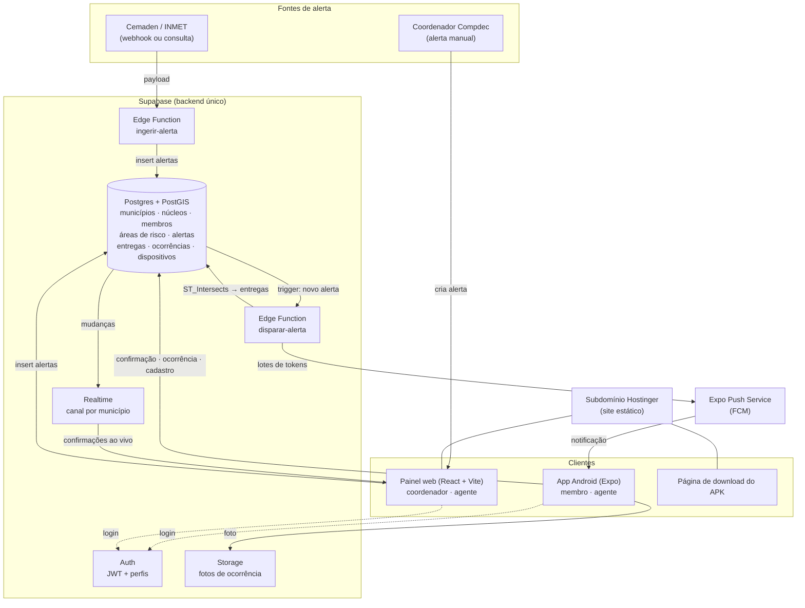

# 03 — Arquitetura

## Diagrama de componentes [12]



Versão em texto, para o slide:

```
[Cemaden / INMET]  [Compdec: alerta manual]
        │                    │
        ▼                    ▼
┌──────────────── Supabase ────────────────┐
│ Auth · Postgres+PostGIS · Storage        │
│ Edge Functions (ingerir, disparar)       │
│ Realtime                                 │
└──────┬──────────────────────┬────────────┘
       │ Expo Push (FCM)      │ API + Realtime
       ▼                      ▼
 App Android (APK)      Painel web + página do APK
 membro · agente        coordenador · agente
                        └── subdomínio Hostinger
```

## Camadas e responsabilidades

| Camada | Componente | Responsabilidade | Onde roda |
|---|---|---|---|
| Fontes | Cemaden/INMET, coordenador | Originar o alerta com área e severidade | Externo / painel |
| Ingestão | Edge Function `ingerir-alerta` | Normalizar o payload externo em um registro `alertas` com geometria | Supabase |
| Dados | Postgres + PostGIS | Verdade única do cadastro, geometria, entregas, ocorrências; RLS por perfil | Supabase |
| Regra | Edge Function `disparar-alerta` + trigger | Selecionar destinatários por interseção geoespacial e enviar push em lotes | Supabase |
| Entrega | Expo Push Service → FCM | Levar a notificação ao aparelho | Expo / Google |
| Cliente móvel | App Expo (APK) | Cadastro, alerta, confirmação, ocorrência, offline-first | Android do membro/agente |
| Cliente web | Painel React | Áreas de risco, alerta manual, acompanhamento em tempo real, triagem | Navegador do coordenador |
| Hospedagem web | Hostinger (estático) | Servir painel e página de download com HTTPS | Hostinger |
| Arquivos | Storage | Fotos de ocorrência com URL assinada | Supabase |

## Tecnologias e a função de cada uma [13]

O enunciado pede pelo menos três componentes tecnológicos com função definida. São oito:

| # | Componente (lista do enunciado) | Tecnologia concreta | Problema que resolve na arquitetura |
|---|---|---|---|
| 1 | Aplicativo móvel | Expo SDK 54 / React Native 0.81, APK Android | Colocar alerta, confirmação e reporte no bolso do voluntário, inclusive offline |
| 2 | Aplicação web | React + Vite + TypeScript | Dar à Compdec um lugar para cadastrar áreas, disparar alertas e acompanhar resultados |
| 3 | Banco de dados | Postgres (Supabase) | Verdade única de cadastro, alertas, entregas e ocorrências, com controle de acesso por linha |
| 4 | Geoprocessamento / SIG | PostGIS + MapLibre GL | Decidir quem recebe o alerta por interseção de polígonos; desenhar áreas; mapa de ocorrências |
| 5 | Computação em nuvem | Supabase (Auth, Storage, Edge Functions, Realtime) + Hostinger | Não manter servidor; escalar o disparo; hospedar o painel com HTTPS |
| 6 | Sistema de alerta | Expo Push Service sobre FCM | Entregar a notificação em segundos a centenas de aparelhos |
| 7 | Redes de computadores | HTTPS/REST, WebSocket (Realtime), cache offline com sincronização | Funcionar com rede instável e mostrar confirmações ao vivo |
| 8 | Análise de dados / dashboard | Views SQL + painel | Calcular a taxa de confirmação em 10 min e a evidência de núcleo ativo |

Evolução com IA (fora do protótipo): classificar a foto da ocorrência por gravidade e sugerir
prioridade de triagem. Ficaria como uma Edge Function chamando um modelo de visão; entraria
como componente 9 se houver tempo.

## Decisões de arquitetura que sustentam o desenho

| Decisão | ADR |
|---|---|
| Backend único no Supabase | [ADR-0002](../docs/adr/0002-supabase-backend-unico.md) |
| App com a stack Expo do NeuroAgora | [ADR-0003](../docs/adr/0003-app-mobile-expo-stack-neuroagora.md) |
| APK por sideload | [ADR-0004](../docs/adr/0004-distribuicao-apk-sideload.md) |
| Painel e download na Hostinger | [ADR-0005](../docs/adr/0005-painel-web-subdominio-hostinger.md) |
| Supabase Auth + RLS | [ADR-0006](../docs/adr/0006-autenticacao-supabase-auth.md) |
| Regra geoespacial + Expo Push | [ADR-0007](../docs/adr/0007-entrega-de-alertas-geoespacial-push.md) |
| Offline-first | [ADR-0008](../docs/adr/0008-offline-first-tanstack-query.md) |

## Ligação com a disciplina

- **Unidade 1 (governança, dados × informação):** o alerta bruto vira informação acionável
  ("58 membros, 3 núcleos, 81 % confirmaram") — entrada, processamento e saída explícitos.
- **Unidade 2 (distribuídas e segurança):** componentes desacoplados por eventos (trigger →
  fila → função), consistência eventual no offline, Zero Trust na prática com RLS por linha e
  JWT por requisição.
- **Unidade 3 (observabilidade):** cada entrega tem `enviado_em`, `entregue_em`,
  `confirmado_em`, `sincronizado_em` — um *trace* do alerta ponta a ponta; a taxa de confirmação
  é um SLI com SLO de 80 % em 10 min.
- **Unidade 4 (ética e LGPD):** dados pessoais mínimos, finalidade explícita, exclusão a
  pedido, sem rastreamento contínuo de localização (GPS só no momento do reporte).
