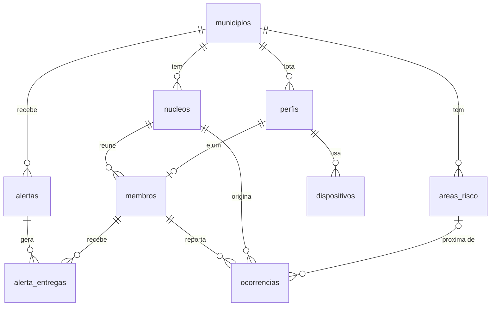

# 04 — Modelo de dados (Supabase)

Schema `public`, PostGIS habilitado, SRID 4326 em todas as geometrias. Todas as tabelas nascem
com RLS habilitada. Este documento é a referência para as migrations em `supabase/migrations/`.

## Diagrama



## Tabelas

### `municipios`
| Coluna | Tipo | Obs |
|---|---|---|
| id | uuid pk | |
| codigo_ibge | char(7) unique | |
| nome | text | |
| uf | char(2) | |
| prioritario | boolean | entra no denominador do indicador oficial |
| limite | geometry(MultiPolygon, 4326) | opcional no protótipo |

### `perfis` (1:1 com `auth.users`)
| Coluna | Tipo | Obs |
|---|---|---|
| id | uuid pk fk auth.users | |
| nome | text | |
| telefone | text | opcional |
| papel | enum `papel` (`membro`,`agente`,`coordenador`) | |
| municipio_id | uuid fk | |
| criado_em | timestamptz | |

### `nucleos`
| Coluna | Tipo | Obs |
|---|---|---|
| id | uuid pk | |
| municipio_id | uuid fk | |
| nome | text | ex.: "Nupdec Morro da Esperança" |
| comunidade | text | bairro/localidade |
| area | geometry(Polygon, 4326) | polígono de atuação, desenhado no painel |
| responsavel_membro_id | uuid fk membros | líder do núcleo |
| status | enum (`ativo`,`inativo`) | |
| criado_em | timestamptz | |

Índice: `gist(area)`.

### `membros`
| Coluna | Tipo | Obs |
|---|---|---|
| id | uuid pk | |
| perfil_id | uuid fk perfis unique | |
| nucleo_id | uuid fk | |
| status | enum (`pendente`,`aprovado`,`rejeitado`,`desligado`) | aprovação pelo agente |
| funcao | text | ex.: "líder", "apoio", "comunicação" |
| aprovado_por | uuid fk perfis | |
| aprovado_em | timestamptz | |

### `dispositivos`
| Coluna | Tipo | Obs |
|---|---|---|
| id | uuid pk | |
| perfil_id | uuid fk | |
| expo_push_token | text unique | `ExponentPushToken[...]` |
| plataforma | text | `android` |
| app_versao | text | |
| atualizado_em | timestamptz | |

### `areas_risco`
| Coluna | Tipo | Obs |
|---|---|---|
| id | uuid pk | |
| municipio_id | uuid fk | |
| nome | text | |
| tipo | enum (`deslizamento`,`inundacao`,`enxurrada`,`outro`) | |
| nivel | enum (`baixo`,`medio`,`alto`,`muito_alto`) | |
| area | geometry(Polygon, 4326) | |
| fonte | text | ex.: "SGB 2024", "Compdec" |

Índice: `gist(area)`.

### `alertas`
| Coluna | Tipo | Obs |
|---|---|---|
| id | uuid pk | |
| municipio_id | uuid fk | |
| origem | enum (`manual`,`cemaden`,`inmet`) | |
| origem_ref | text | id externo, quando houver |
| tipo | enum (`deslizamento`,`inundacao`,`enxurrada`,`vendaval`,`outro`) | |
| severidade | enum (`observacao`,`atencao`,`alerta`,`alerta_maximo`) | escala usada pelo Cemaden |
| titulo | text | |
| mensagem | text | |
| area | geometry(MultiPolygon, 4326) | área de abrangência |
| inicio_em | timestamptz | |
| encerrado_em | timestamptz | null = vigente |
| criado_por | uuid fk perfis | null quando ingestão |
| criado_em | timestamptz | |

Índices: `gist(area)`, `(municipio_id, encerrado_em)`.

### `alerta_entregas` — uma linha por membro afetado
| Coluna | Tipo | Obs |
|---|---|---|
| id | uuid pk | |
| alerta_id | uuid fk | |
| membro_id | uuid fk | |
| nucleo_id | uuid fk | desnormalizado para agregação |
| status | enum (`sem_dispositivo`,`enviado`,`entregue`,`falha`) | |
| push_ticket | text | id retornado pelo Expo Push |
| enviado_em | timestamptz | |
| entregue_em | timestamptz | via recibo do Expo, quando disponível |
| confirmado_em | timestamptz | **hora do clique no aparelho** (vem do cliente) |
| sincronizado_em | timestamptz | hora em que a confirmação chegou ao servidor |

Unique `(alerta_id, membro_id)`.

### `ocorrencias`
| Coluna | Tipo | Obs |
|---|---|---|
| id | uuid pk | gerado no cliente (idempotência offline) |
| membro_id | uuid fk | |
| nucleo_id | uuid fk | |
| alerta_id | uuid fk | opcional: ocorrência ligada a um alerta |
| tipo | enum (`trinca`,`deslizamento`,`alagamento`,`arvore`,`bueiro`,`outro`) | |
| descricao | text | |
| local | geometry(Point, 4326) | GPS do aparelho |
| precisao_m | numeric | precisão informada pelo GPS |
| foto_path | text | caminho no bucket `ocorrencias` |
| area_risco_id | uuid fk | preenchido por trigger: área de risco mais próxima (≤ 200 m) |
| status | enum (`nova`,`em_analise`,`atendida`,`descartada`) | |
| triado_por | uuid fk perfis | |
| criado_em | timestamptz | hora do aparelho |
| recebido_em | timestamptz | hora do servidor |

Índice: `gist(local)`.

## Views para indicadores

```sql
-- taxa de confirmação por alerta
create view v_alerta_confirmacao as
select a.id as alerta_id, a.municipio_id, a.titulo, a.inicio_em,
       count(e.*)                                        as destinatarios,
       count(e.*) filter (where e.status <> 'sem_dispositivo') as com_dispositivo,
       count(e.confirmado_em)                            as confirmados,
       count(e.confirmado_em) filter (where e.confirmado_em <= e.enviado_em + interval '10 minutes') as confirmados_10min,
       round(100.0 * count(e.confirmado_em) filter (where e.confirmado_em <= e.enviado_em + interval '10 minutes')
             / nullif(count(e.*),0), 1)                  as pct_confirmado_10min,
       percentile_cont(0.5) within group (order by e.confirmado_em - e.enviado_em) as mediana_tempo
from alertas a left join alerta_entregas e on e.alerta_id = a.id
group by a.id;

-- núcleo ativo = evidência para o indicador oficial
create view v_nucleo_atividade as
select n.id as nucleo_id, n.municipio_id, n.nome,
       count(m.*) filter (where m.status = 'aprovado') as membros_aprovados,
       max(e.confirmado_em)                            as ultima_confirmacao,
       count(o.*) filter (where o.criado_em > now() - interval '90 days') as ocorrencias_90d
from nucleos n
left join membros m on m.nucleo_id = n.id
left join alerta_entregas e on e.nucleo_id = n.id
left join ocorrencias o on o.nucleo_id = n.id
group by n.id;
```

## Políticas RLS (resumo)

Função auxiliar `auth_perfil()` retorna `(papel, municipio_id, membro_id, nucleo_id)` do usuário
logado a partir de `auth.uid()`.

| Tabela | select | insert | update |
|---|---|---|---|
| perfis | próprio; agente/coordenador: do município | próprio (no cadastro) | próprio |
| nucleos | do município | coordenador | coordenador |
| membros | do próprio núcleo; agente/coordenador: do município | próprio (status = pendente) | próprio (dados); agente/coordenador (status) |
| dispositivos | próprio | próprio | próprio |
| areas_risco | do município | coordenador | coordenador |
| alertas | membro: onde existe entrega para ele; agente/coordenador: do município | coordenador | coordenador |
| alerta_entregas | próprio; agente/coordenador: do município | só service_role | próprio (`confirmado_em`) |
| ocorrencias | do próprio núcleo; agente/coordenador: do município | membro aprovado (próprio) | agente/coordenador (status, triagem) |

Bucket `ocorrencias` (privado): upload pelo membro em `municipio_id/nucleo_id/ocorrencia_id.jpg`;
leitura por URL assinada gerada para quem tem select na ocorrência.

## Edge Functions

| Função | Gatilho | Faz |
|---|---|---|
| `ingerir-alerta` | HTTP POST (webhook) ou cron a cada 10 min | Normaliza payload externo, resolve a geometria (área informada ou limite do município), insere em `alertas` |
| `disparar-alerta` | Database webhook em insert de `alertas` | Seleciona membros por `ST_Intersects`, insere `alerta_entregas`, envia push em lotes de 100 ao Expo, grava tickets; reprocessa pendências |
| `recibos-push` | Cron a cada 15 min | Consulta recibos no Expo e preenche `entregue_em` / `falha`; remove tokens inválidos |

## Seed do município-exemplo

Município fictício "Vale Sereno – SP" (código IBGE fictício), 5 núcleos com polígonos, 4 áreas
de risco, 100 membros, 1 coordenador, 3 agentes, 2 alertas históricos com entregas e
confirmações, 12 ocorrências. Serve para o pitch e para as capturas de tela.
